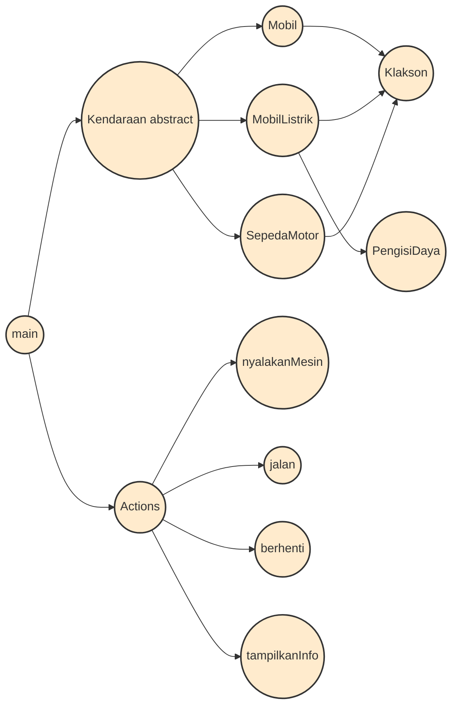

# Abstraction Sample Flowchart

Diagram berikut menunjukkan alur konsep `Vehicle.java` pada sample Abstraction.

```mermaid
flowchart LR
    A((main)) --> B((Kendaraan abstract))
    B --> C((Mobil))
    B --> D((MobilListrik))
    B --> E((SepedaMotor))
    C --> F((Klakson))
    D --> G((PengisiDaya))
    D --> F
    E --> F
    A --> H((Actions))
    H --> I((nyalakanMesin))
    H --> J((jalan))
    H --> K((berhenti))
    H --> L((tampilkanInfo))
    classDef bubble fill:#ffebcd,stroke:#333,stroke-width:2px;
    class A,B,C,D,E,F,G,H,I,J,K,L bubble;
```
