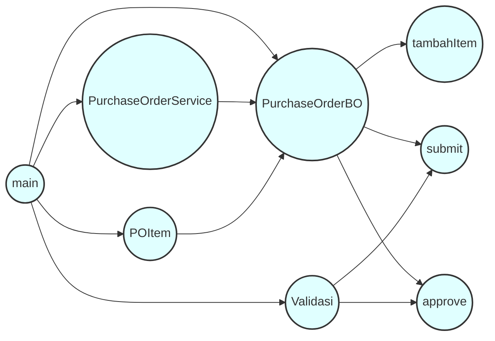

# Business Object Sample Flowchart

Diagram berikut menunjukkan alur logika `PurchaseOrder.java`.

```mermaid
flowchart LR
    A((main)) --> B((PurchaseOrderBO))
    A --> C((POItem))
    A --> D((PurchaseOrderService))
    B --> E((tambahItem))
    B --> F((submit))
    B --> G((approve))
    D --> B
    C --> B
    A --> H((Validasi))
    H --> F
    H --> G
    classDef bubble fill:#e0ffff,stroke:#333,stroke-width:2px;
    class A,B,C,D,E,F,G,H bubble;
```
