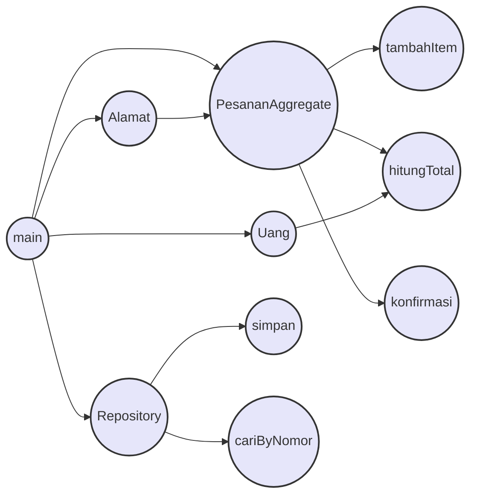

# DDD Sample Flowchart

Diagram berikut menunjukkan alur `OrderAggregate.java` pada sample Domain Driven Design.

```mermaid
flowchart LR
    A((main)) --> B((PesananAggregate))
    A --> C((Uang))
    A --> D((Alamat))
    B --> E((tambahItem))
    B --> F((hitungTotal))
    B --> G((konfirmasi))
    A --> H((Repository))
    H --> I((simpan))
    H --> J((cariByNomor))
    C --> F
    D --> B
    classDef bubble fill:#e6e6fa,stroke:#333,stroke-width:2px;
    class A,B,C,D,E,F,G,H,I,J bubble;
```
