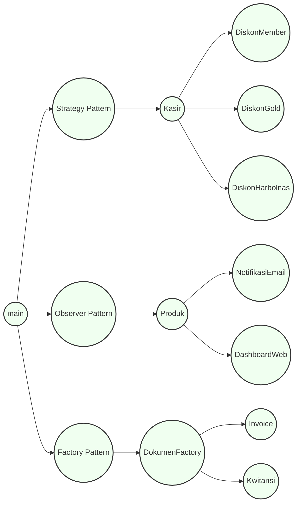

# Design Patterns Sample Flowchart

Diagram berikut menunjukkan alur `DiscountStrategy.java`.

```mermaid
flowchart LR
    A((main)) --> B((Strategy Pattern))
    A --> C((Observer Pattern))
    A --> D((Factory Pattern))
    B --> E((Kasir))
    E --> F((DiskonMember))
    E --> G((DiskonGold))
    E --> H((DiskonHarbolnas))
    C --> I((Produk))
    I --> J((NotifikasiEmail))
    I --> K((DashboardWeb))
    D --> L((DokumenFactory))
    L --> M((Invoice))
    L --> N((Kwitansi))
    classDef bubble fill:#f0fff0,stroke:#333,stroke-width:2px;
    class A,B,C,D,E,F,G,H,I,J,K,L,M,N bubble;
```
