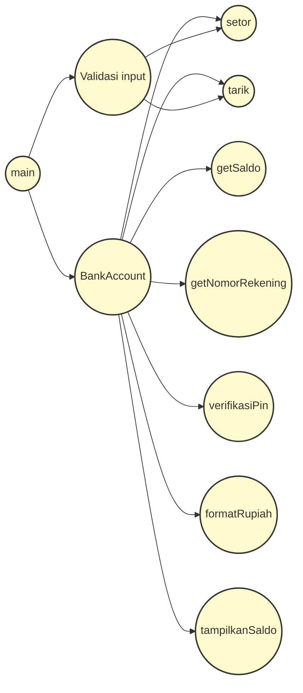

# Encapsulation Sample Flowchart

Diagram berikut menunjukkan alur `BankAccount.java`.

```mermaid
flowchart LR
    A((main)) --> B((BankAccount))
    B --> C((setor))
    B --> D((tarik))
    B --> E((getSaldo))
    B --> F((getNomorRekening))
    B --> G((verifikasiPin))
    B --> H((formatRupiah))
    B --> I((tampilkanSaldo))
    A --> J((Validasi input))
    J --> C
    J --> D
    classDef bubble fill:#fffacd,stroke:#333,stroke-width:2px;
    class A,B,C,D,E,F,G,H,I,J bubble;
```
