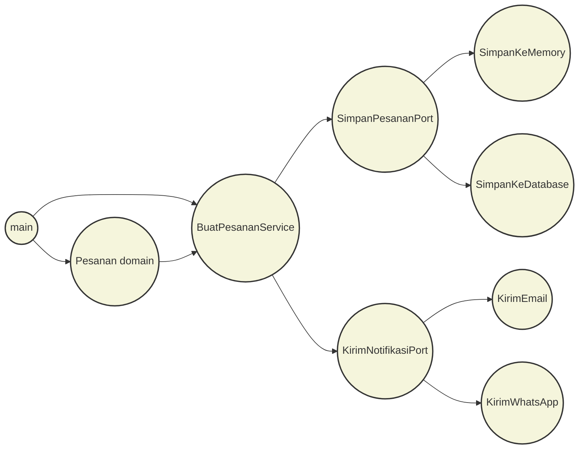

# Hexagonal Architecture Sample Flowchart

Diagram berikut menunjukkan alur `HexagonalOrder.java`.

```mermaid
flowchart LR
    A((main)) --> B((BuatPesananService))
    B --> C((SimpanPesananPort))
    B --> D((KirimNotifikasiPort))
    C --> E((SimpanKeMemory))
    C --> F((SimpanKeDatabase))
    D --> G((KirimEmail))
    D --> H((KirimWhatsApp))
    A --> I((Pesanan domain))
    I --> B
    classDef bubble fill:#f5f5dc,stroke:#333,stroke-width:2px;
    class A,B,C,D,E,F,G,H,I bubble;
```
