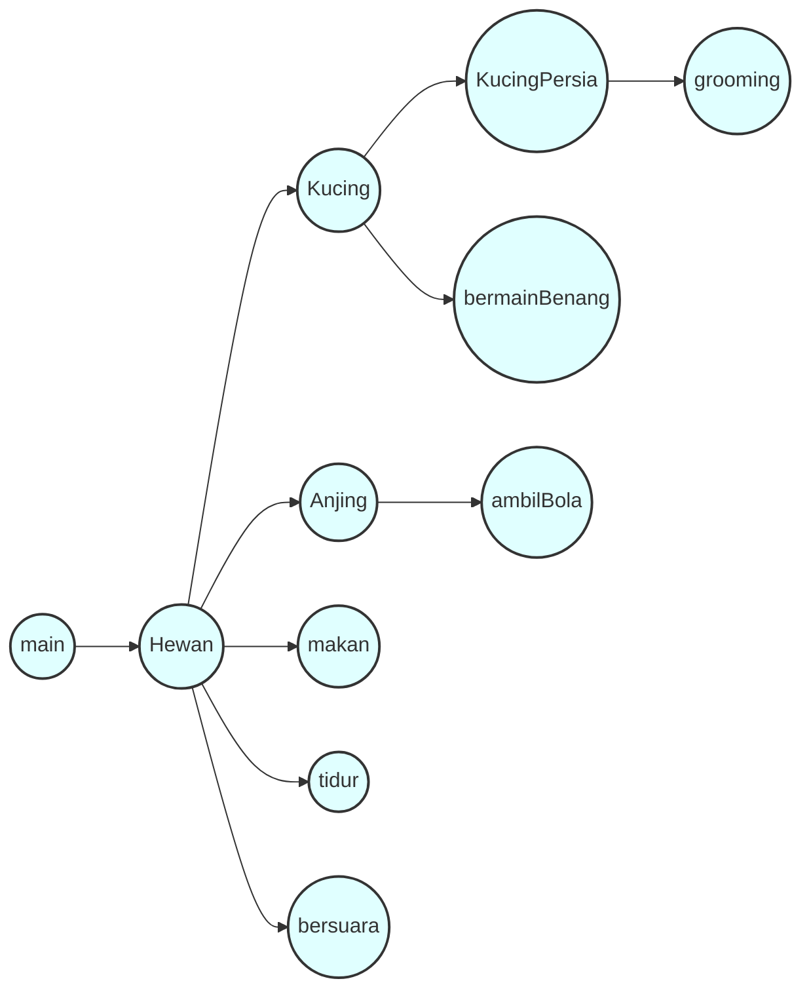

# Inheritance Sample Flowchart

Diagram berikut menunjukkan alur `Animal.java`.

```mermaid
flowchart LR
    A((main)) --> B((Hewan))
    B --> C((Kucing))
    B --> D((Anjing))
    C --> E((KucingPersia))
    B --> F((makan))
    B --> G((tidur))
    B --> H((bersuara))
    C --> I((bermainBenang))
    D --> J((ambilBola))
    E --> K((grooming))
    classDef bubble fill:#e0ffff,stroke:#333,stroke-width:2px;
    class A,B,C,D,E,F,G,H,I,J,K bubble;
```
