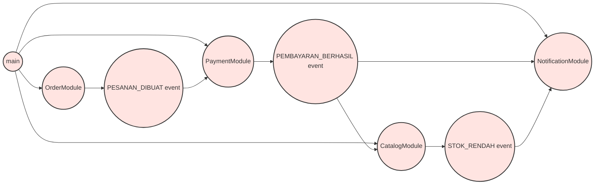

# Modular Monolith Sample Flowchart

Diagram berikut menunjukkan alur `ModularECommerce.java`.

```mermaid
flowchart LR
    A((main)) --> B((OrderModule))
    A --> C((PaymentModule))
    A --> D((CatalogModule))
    A --> E((NotificationModule))
    B --> F((PESANAN_DIBUAT event))
    F --> C
    C --> G((PEMBAYARAN_BERHASIL event))
    G --> D
    G --> E
    D --> H((STOK_RENDAH event))
    H --> E
    classDef bubble fill:#ffe4e1,stroke:#333,stroke-width:2px;
    class A,B,C,D,E,F,G,H bubble;
```
