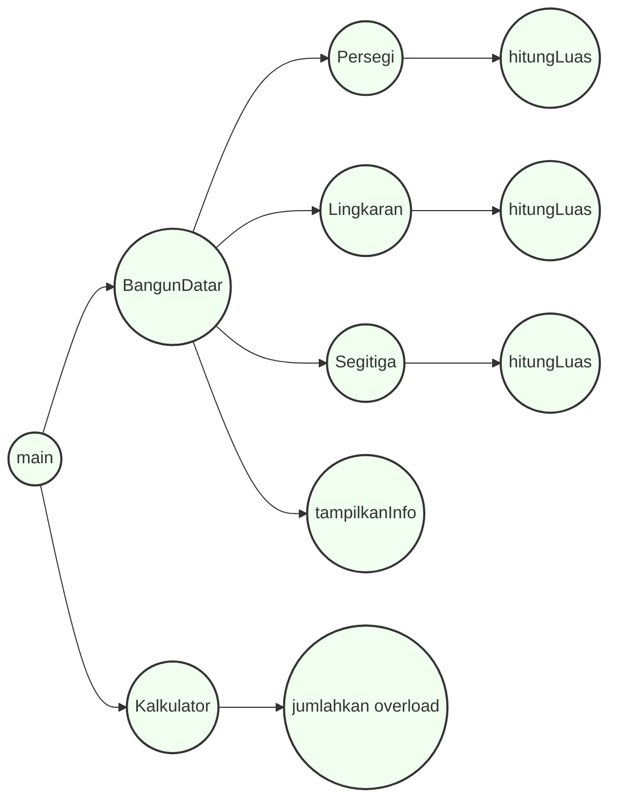

# Polymorphism Sample Flowchart

Diagram berikut menunjukkan alur `Shape.java`.

```mermaid
flowchart LR
    A((main)) --> B((BangunDatar))
    B --> C((Persegi))
    B --> D((Lingkaran))
    B --> E((Segitiga))
    A --> F((Kalkulator))
    F --> G((jumlahkan overload))
    B --> H((tampilkanInfo))
    C --> I((hitungLuas))
    D --> J((hitungLuas))
    E --> K((hitungLuas))
    classDef bubble fill:#f0fff0,stroke:#333,stroke-width:2px;
    class A,B,C,D,E,F,G,H,I,J,K bubble;
```
