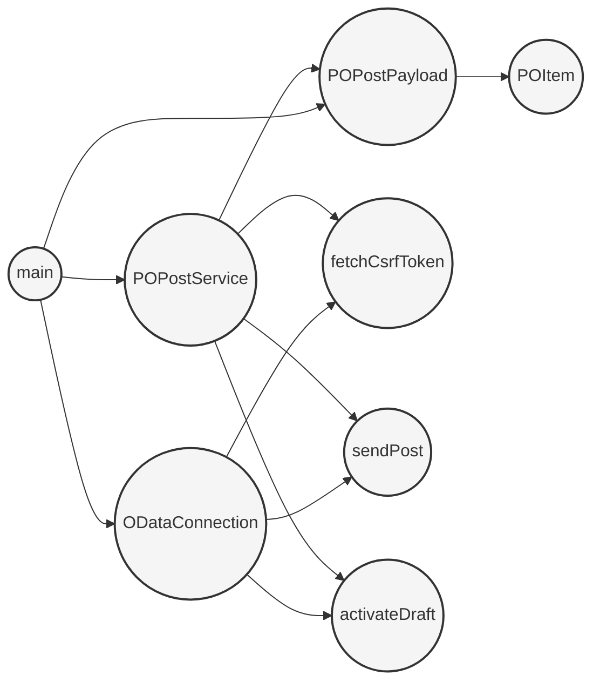

# SAP OData Sample Flowchart

Diagram berikut menunjukkan alur `OdataCreatePO.java` dan `05_PostData_ODataCreate.java`.

```mermaid
flowchart LR
    A((main)) --> B((ODataConnection))
    A --> C((POPostPayload))
    B --> D((fetchCsrfToken))
    B --> E((sendPost))
    B --> F((activateDraft))
    C --> G((POItem))
    A --> H((POPostService))
    H --> D
    H --> E
    H --> F
    H --> C
    classDef bubble fill:#f5f5f5,stroke:#333,stroke-width:2px;
    class A,B,C,D,E,F,G,H bubble;
```
