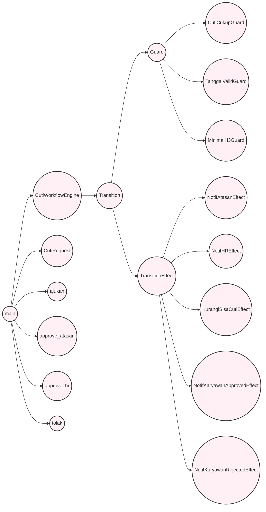

# Workflow Engine Sample Flowchart

Diagram berikut menunjukkan alur `LeaveRequest.java`.

```mermaid
flowchart LR
    A((main)) --> B((CutiWorkflowEngine))
    A --> C((CutiRequest))
    B --> D((Transition))
    D --> E((Guard))
    D --> F((TransitionEffect))
    A --> G((ajukan))
    A --> H((approve_atasan))
    A --> I((approve_hr))
    A --> J((tolak))
    E --> K((CutiCukupGuard))
    E --> L((TanggalValidGuard))
    E --> M((MinimalH3Guard))
    F --> N((NotifAtasanEffect))
    F --> O((NotifHREffect))
    F --> P((KurangiSisaCutiEffect))
    F --> Q((NotifKaryawanApprovedEffect))
    F --> R((NotifKaryawanRejectedEffect))
    classDef bubble fill:#fff0f5,stroke:#333,stroke-width:2px;
    class A,B,C,D,E,F,G,H,I,J,K,L,M,N,O,P,Q,R bubble;
```
